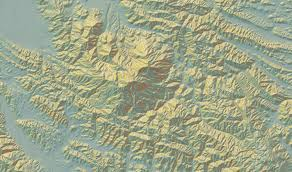

# 🚀 AWS Terrarium DEM Tile Downloader 🌍



**Fetch high-resolution terrain elevation data directly from AWS with blazing speed!** ⚡️

This command-line powerhouse downloads and verifies Terrarium-encoded Digital Elevation Model (DEM) tiles from the AWS Open Data Terrain Tiles dataset. Define your area, pick your zoom levels, and let the tool handle the rest, organizing tiles perfectly in the standard `z/x/y` structure and generating a ready-to-use `tiles.json` for your mapping projects.

<!-- Optional Badges (replace placeholders) -->
<p align="center">
  
  
  <!-- /<your-repo>/.github/workflows/ci.yml?branch=main" alt="Build Status"> -->
</p>

## Why Use This Tool? 🤔

*   **🎯 Precision Downloading:** Grab exactly the tiles you need for your specific geographic area (Bounding Box).
*   **🔎 Zoom Control:** Select the precise level of detail required for your application (Zooms 0-15).
*   **💨 Concurrent Speed:** Downloads tiles *much* faster using multiple threads – essential for large areas!
*   **✅ Data Integrity:** Verify your existing tile cache for missing or corrupt files (basic dimension check).
*   **🗺️ Map-Ready Output:** Automatically generates a `tiles.json` metadata file, compatible with MapLibre GL JS, Leaflet, Mapbox GL JS, and more!
*   **💡 Smart Fetching:** Option to download *only* the tiles you're missing, saving time and bandwidth.
*   **📊 Clear Reporting:** Get detailed JSON reports on download/check status, including any failures.
*   **💻 Simple CLI:** A clean and intuitive command-line interface powered by Click.

## Requirements 🛠️

*   Python 3.7+
*   Libraries listed in `requirements.txt` (see below)

## Installation ⚙️

1.  **Clone the Magic:**
    ```bash
    git clone <your-repository-url> # Or download the source code
    cd AWS-Dem-Downloader
    ```
2.  **Create Your Sandbox (Recommended):**
    ```bash
    python3 -m venv venv
    source venv/bin/activate  # On Windows use `venv\Scripts\activate`
    ```
3.  **Install the Goods:**
    ```bash
    pip install -r requirements.txt
    ```
4.  **Make it Executable (Linux/macOS - Optional):**
    ```bash
    chmod +x terrain_cli.py
    ```

## How to Use It 🕹️

Fire up the tool from your terminal:

```bash
./terrain_cli.py [OPTIONS] COMMAND [ARGS]...
```

**Global Options:**

*   `-h`, `--help`: Show the help screen and exit.
*   `--version`: Display the tool's version and exit.

---

### `download` Command 📥

Fetches tiles for your chosen region and zoom levels.

**Syntax:**

```bash
./terrain_cli.py download [OPTIONS] -- <min_lon,min_lat,max_lon,max_lat>
```
*   **🚨 Heads Up!** The `--` before the BBOX is **mandatory** if your minimum longitude (`min_lon`) is negative! This tells the tool it's an argument, not an option.

**Arguments:**

*   `<min_lon,min_lat,max_lon,max_lat>`: Your target bounding box (WGS84).

**Options:**

*   `-z, --zoom-range <min,max>`: Zoom levels (e.g., `10,14`). Default: `10,15`. Max: `15`.
*   `-o, --output-dir <dir>`: Where to save tiles. Default: `terrain_tiles`.
*   `-c, --concurrency <int>`: How many download threads to use. Default: `10`.
*   `--only-missing`: Smart mode! Only download missing tiles.
*   `-y, --yes`: Skip the confirmation prompt (useful for scripting).

**Examples:**

```bash
# Grab zooms 10-14 for Los Angeles (Note the '--'!)
./terrain_cli.py download -z 10,14 -- -118.67,33.70,-118.15,34.34

# Download only missing tiles for zoom 12, super fast (20 workers), no prompt
./terrain_cli.py download -z 12,12 -c 20 --only-missing -y -- -118.67,33.70,-118.15,34.34

# Download zooms 10-13 into a custom 'la_tiles' folder
./terrain_cli.py download -z 10,13 -o ./la_tiles -- -118.67,33.70,-118.15,34.34
```

---

### `check` Command ✅

Inspects an existing tile directory against a bounding box, checking for missing or improperly sized tiles.

**Syntax:**

```bash
./terrain_cli.py check [OPTIONS] -- <min_lon,min_lat,max_lon,max_lat>
```
*   **🚨 Heads Up!** The `--` before the BBOX is **mandatory** if `min_lon` is negative!

**Arguments:**

*   `<min_lon,min_lat,max_lon,max_lat>`: The bounding box to check against.

**Options:**

*   `-z, --zoom-range <min,max>`: Zoom levels to check (e.g., `10,14`). Default: `10,15`. Max: `15`.
*   `-o, --output-dir <dir>`: The directory containing tiles to check. Default: `terrain_tiles`.

**Examples:**

```bash
# Check zooms 10-14 for Los Angeles in the default 'terrain_tiles' dir (Note the '--'!)
./terrain_cli.py check -z 10,14 -- -118.67,33.70,-118.15,34.34

# Check only zoom 12 within the 'la_tiles' directory
./terrain_cli.py check -z 12,12 -o ./la_tiles -- -118.67,33.70,-118.15,34.34
```

---

## The Magic `tiles.json` ✨

After downloading, you'll find a `tiles.json` file in your output directory (e.g., `terrain_tiles/tiles.json`). This little file is your key to using these tiles in mapping libraries! It follows the [TileJSON specification](https://github.com/mapbox/tilejson-spec) and contains all the essential metadata:

*   🗺️ Tile URL pattern (relative: `{z}/{x}/{y}.png`)
*   🌐 Bounding box of your downloaded area
*   📍 Estimated center point
*   🔍 Min/Max zoom levels included
*   📜 Data attribution
*   🔢 Encoding type (`terrarium`)

## File Structure Layout 📂

```
AWS-Dem-Downloader/
├── terrain_cli.py        # The main script you run
├── terrain_utils.py      # The core logic engine
├── requirements.txt      # Dependencies list
├── terrain_tiles/        # Default output folder
│   ├── 0/                # Zoom level folders...
│   ├── ...
│   ├── 15/
│   │   ├── x_coord/      # Tile X coordinate folder
│   │   │   └── y_coord.png # The actual tile image!
│   │   └── ...
│   ├── tiles.json        # ✨ Your map-ready metadata!
│   ├── download_report.json # Log of the last download
│   └── check_report.json    # Log of the last check
├── public/
│   └── terrarium.png     # The cool image at the top
└── README.md             # This awesome file
```

## Understanding Terrarium Tiles ⛰️

The downloaded PNG tiles use the [Terrarium specification](https://github.com/tilezen/joerd/blob/master/docs/formats.md#terrarium-10). To get the elevation `h` (in meters) from the Red (R), Green (G), and Blue (B) pixel values (0-255):

`h = (R * 256 + G + B / 256) - 32768`

## License 📜

This project is under the MIT License - see the `LICENSE` file (create one if needed!) for the full text. Feel free to use and modify!

## Credits 🙏

*   Elevation data generously provided by the [AWS Open Data Terrain Tiles](https://registry.opendata.aws/terrain-tiles/) dataset.
*   Based on the Terrarium tile specification pioneered by Mapzen/Tilezen.
